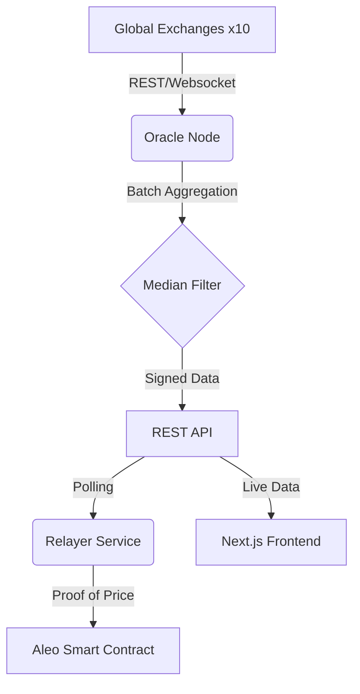

# Aleo Privacy-Preserving Oracle

[](https://aleo.org)
[](https://www.typescriptlang.org/)
[](https://nextjs.org/)
[](https://aleo-oracle.io)

A decentralized, privacy-preserving token price oracle for the Aleo blockchain. Optimized for **10 major assets** across **10 global exchanges**, featuring **Batch-Fetched CoinGecko pricing**, **TWAP (Time-Weighted Average Price)**, and **On-Chain Circuit Breaker Protection**.

---

## ⚡ Core Technical Specifications

| Feature | Specification |
|---------|---------------|
| **Data Sources** | 10 Tier-1 Exchanges (Binance, Coinbase, Kraken, OKX, etc.) |
| **Asset Pairs** | ETH, BTC, ALEO, SOL, AVAX, POL (formerly MATIC), DOT, ATOM, LINK, UNI |
| **Aggregation** | Outlier-resistant Median Aggregation with 5% threshold |
| **Refresh Rate** | 10s (Off-chain) \| 30s-300s (On-chain via Relayer) |
| **Integrations** | Next.js 14 Frontend, Leo Smart Contracts, TypeScript Node |
| **Privacy** | Zero-Knowledge collateral positions and private price consumption |

---

## 🏗 Architecture Overview



---

## 🚀 Getting Started (WSL Recommended)

### 1. Prerequisites
- **Node.js** v18+ 
- **Leo CLI** installed (for contract development)
- **WSL (Ubuntu)** - Required for stable build performance

### 2. Installation
```bash
# Clone the repository
git clone https://github.com/your-repo/aleo-oracle.git
cd aleo-oracle

# Install all dependencies (Native WSL environment)
cd oracle-node && npm install
cd ../relayer && npm install
cd ../frontend && npm install
```

### 3. Execution (Simultaneous Terminals)

**Terminal 1: Oracle Node (The Brain)**
```bash
cd oracle-node
npm run dev
```

**Terminal 2: Relayer (The Messenger)**
```bash
cd relayer
npm run dev
```

**Terminal 3: Frontend (the Window)**
```bash
cd frontend
npm run dev
```

Visit `http://localhost:3001` to interact with the dashboard.

---

## 🛡 Security & Reliability Features

### CoinGecko Batching & Cooldown
The system implements a proprietary batching engine for CoinGecko. Instead of individual API calls, we perform **single-request fetches** to avoid rate limiting. If a `429` error is detected, the provider enters an automatic **2-minute cooldown** and falls back to stale cache data.

### Multi-Source Failover
Prices require at least **3 valid sources** (2 for ALEO/USD). If an exchange goes down, the oracle automatically recalculates using the remaining active sources without downtime.

### On-Chain Circuit Breaker
Every price submission is checked against the last on-chain value. If a single update exceeds **10% deviation**, the contract enters a **Halted** state, protecting consumer protocols (like Lending) from flash crashes or manipulation.

---

## 📅 Roadmap: Phase 1 & Beyond

### ✅ Phase 1: Heavy Expansion (Completed)
- [x] Expanded to 10 trading pairs & 10 providers.
- [x] Implemented TWAP (1h, 24h, 7d).
- [x] Hardened CoinGecko rate limiting.
- [x] Refactored Frontend for SSR & Wallet compatibility.

### 🔥 Phase 2: DeFi Deep Integration (In Progress)
- [ ] **Multi-Operator Consensus**: Median aggregation performed on-chain.
- [ ] **Oracle SDK**: NPM package for 1-line integration into Aleo dApps.
- [ ] **Perpetuals Engine**: Specific high-frequency feeds for leverage trading.
- [ ] **Governance Portal**: DAO voting to resume halted circuit breakers.

---

## 📄 License
Distributed under the MIT License. See `LICENSE` for more information.

---

Built for the **Aleo** community. Powered by Zero-Knowledge.
